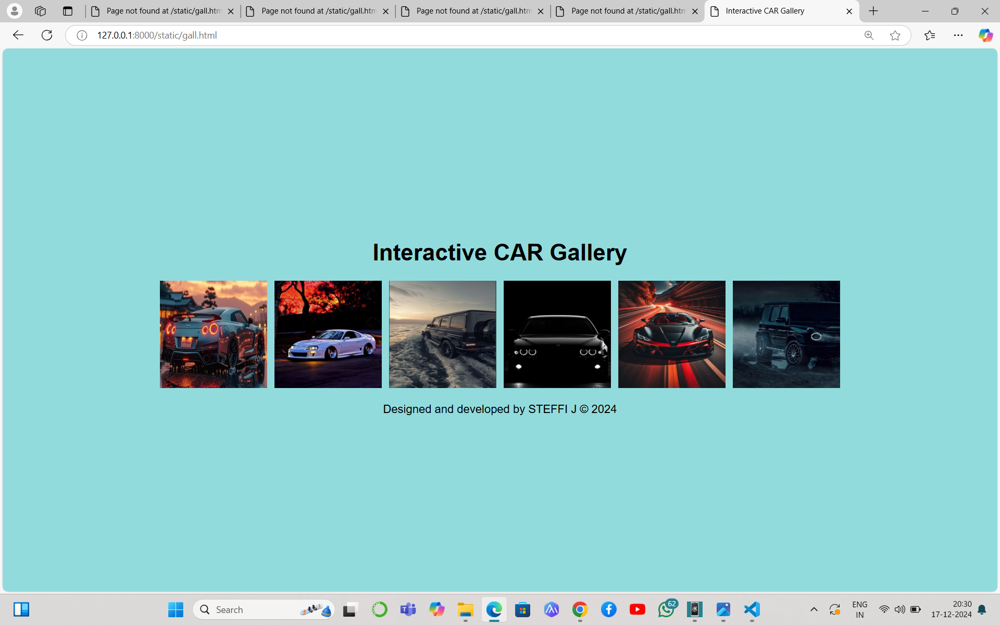

# Ex.08 Design of Interactive Image Gallery
## Date:17.12.2024

## AIM:
To design a web application for an inteactive image gallery with minimum five images.

## DESIGN STEPS:

### Step 1:
Clone the github repository and create Django admin interface.

### Step 2:
Change settings.py file to allow request from all hosts.

### Step 3:
Use CSS for positioning and styling.

### Step 4:
Write JavaScript program for implementing interactivity.

### Step 5:
Validate the HTML and CSS code.

### Step 6:
Publish the website in the given URL.

## PROGRAM :
```
<!DOCTYPE html>
<html lang="en">
<head>
    <meta charset="UTF-8">
    <meta name="viewport" content="width=device-width, initial-scale=1.0">
    <title>Interactive CAR Gallery </title>
    <style>
        body {
            font-family: Arial, sans-serif;
            background-color: rgb(146, 219, 221);
            display: flex;
            justify-content: center;
            align-items: center;
            min-height: 100vh; 
            margin: 0;
            flex-direction: column;
        }

        .gallery-container {
            text-align: center;
            width: 100%;
        }

        .gallery {
            display: flex;
            flex-wrap: wrap;
            justify-content: center;
            gap: 10px; 
        }

        .gallery-item {
            width: 150px; 
            height: 150px;
            transition: transform 0.3s ease;
        }

        footer {
            text-align: center;
            font-size: 16px;
            margin-top: 20px; 
        }
    </style>
</head>
<body>
    <div class="gallery-container">
        <h1>Interactive CAR Gallery </h1>
        <div class="gallery">
            
            
            
            
            
            
           
        </div>
    </div>
    <footer>
        Designed and developed by STEFFI J &copy; 2024
    </footer>
    <script>
        document.querySelectorAll('.gallery-item').forEach(item => {
            item.addEventListener('mouseover', () => {
                item.style.transform = 'scale(1.5)';
                item.style.zIndex = '1';
            });
            item.addEventListener('mouseout', () => {
                item.style.transform = 'scale(1)';
                item.style.zIndex = '0';
            });
        });
    </script>
</body>
</html>
```
## OUTPUT:
           
## RESULT:
The program for designing an interactive image gallery using HTML, CSS and JavaScript is executed successfully.
